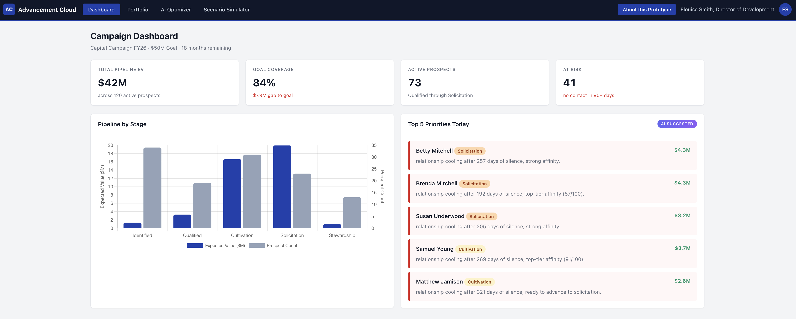
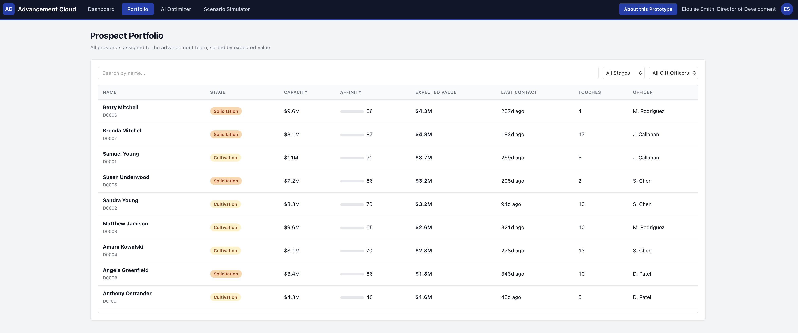
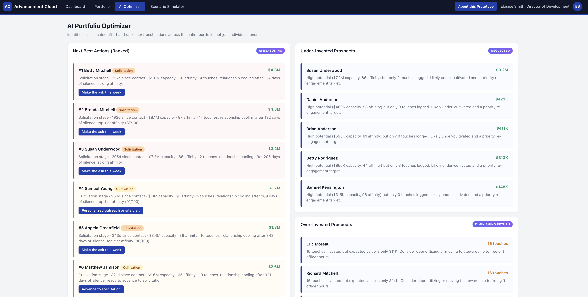
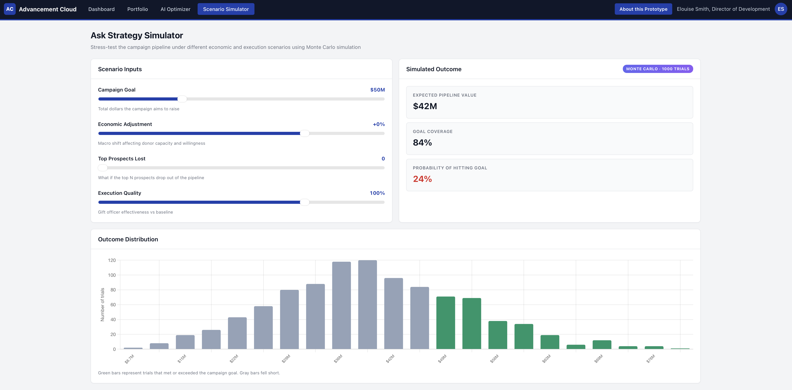

# Portfolio Optimizer & Ask Strategy Simulator

A product concept prototype for the fundraising intelligence market. This demo shows how portfolio-level AI optimization and Monte Carlo scenario planning could extend beyond what current fundraising intelligence vendors ship today.

**Live demo:** [https://jesimpsonjr-prodmgmt.github.io/fundraising-portfolio-optimizer/](https://jesimpsonjr-prodmgmt.github.io/fundraising-portfolio-optimizer/)

> Built as a portfolio piece by [John Simpson](https://johnsimpson.io).

---

## The Problem

Fundraising intelligence platforms have converged on the same feature set. Wealth screening, capacity scores, AI-drafted emails, and contact report summarization are now table stakes across every major fundraising software provider. All of it operates at the individual donor level.

None of it optimizes the gift officer's entire portfolio as a system. None of it lets leadership stress-test campaign outcomes under realistic scenarios.

A Director of Advancement managing a $50M capital campaign does not need another tool that drafts a friendlier email. They need to know:

1. Which five prospects out of one hundred fifty deserve attention this week
2. Which donors are consuming gift officer hours with diminishing returns
3. Whether the campaign is actually on track if the top three gifts soften by 30 percent

This prototype addresses all three.

---

## What It Demonstrates

### 1. Portfolio-Level Optimization

Ranks next-best actions across the full prospect pool using a composite score of expected value, stage, affinity, recency, and effort invested. Most platforms rank at the single-donor level. This one ranks at the portfolio level, which is what a gift officer with 150 active prospects actually needs to plan their week.

### 2. Misallocation Detection

Two panels that no current vendor surfaces:

- **Under-Invested Prospects.** High expected value, few touches logged. These are the neglected opportunities.
- **Over-Invested Prospects.** Low expected value, high touches. These are the black holes consuming cultivation hours with diminishing returns.

### 3. Monte Carlo Scenario Simulation

Real 1000-trial probabilistic simulation running in the browser. Four sliders (campaign goal, economic adjustment, top prospects lost, execution quality) drive a live stress test showing the distribution of possible outcomes and the probability of hitting campaign goal under each scenario.

### 4. Unified Advancement Shell

A generic Salesforce-style interface showing how this capability would layer alongside any existing fundraising CRM. Brand-agnostic by design.

---

## Screenshots

### Dashboard
Campaign KPIs, pipeline by stage, and AI-suggested top priorities for today.



### Prospect Portfolio
Filterable table of 120 synthetic prospects with capacity, affinity, expected value, and engagement metrics.



### AI Optimizer
Next-best actions ranked across the portfolio, plus over-invested and under-invested flags.



### Ask Strategy Simulator
Monte Carlo scenario simulation with sliders for campaign goal, economic conditions, top-prospect attrition, and execution quality. Outputs a probability distribution of campaign outcomes.



---

## Product Management Framing

**Target user.** Gift officer and Director of Advancement managing 100 to 200 active prospects toward a multi-year capital campaign goal.

**Key metrics.**
- Pipeline coverage ratio
- Expected value lift per gift officer hour
- Reduction in wasted cultivation time
- Probability of hitting campaign goal
- Forecast accuracy against actual closed gifts

**Integration story.** Reads from existing CRM donor records (Salesforce Advancement, Blackbaud Raiser's Edge NXT, Ellucian Advance). Writes back recommended next actions, urgency flags, and portfolio health scores. Zero workflow displacement for the gift officer.

**Differentiation.** Major fundraising intelligence vendors launched assistant-style generative AI features throughout 2025 and into 2026. All of it operates at the single-donor level and focuses on content generation. Portfolio-level optimization and probabilistic scenario planning remain unclaimed territory in this market.

---

## How It Works (Technical Overview)

Everything runs in a single self-contained HTML file. No build step, no backend, no dependencies to install.

- **Synthetic data.** 120 prospects generated at page load using a seeded PRNG (Mulberry32), so the same dataset appears every time the page loads. Fully reproducible.
- **Capacity distribution.** Lognormal, ranging from $25K to $8M, with eight injected major prospects in the $3M to $12M range to create a realistic campaign pipeline.
- **Expected value calculation.** Capacity times probability of giving, where probability is derived from stage base rate, affinity factor, and recency decay.
- **Optimizer scoring.** Urgency-weighted expected value with stage multipliers. Solicitation weights highest, Stewardship lowest.
- **Monte Carlo simulation.** 1000 independent trials per slider change. Each trial samples a Bernoulli outcome per donor, applies gift-size noise, and sums. Runs in under 20 milliseconds.
- **AI reasoning.** Deterministic scoring logic running locally in the browser. No live language model, no API keys, no data leaves your device.

**Dependencies.** Chart.js v4 loaded from CDN for the visualizations. That is the only external asset.

---

## Running It Locally

Clone the repo and open the HTML file in any modern browser. That is it.

```
git clone https://github.com/jesimpsonjr-prodmgmt/fundraising-portfolio-optimizer.git
cd fundraising-portfolio-optimizer
open index.html
```

No server, no build, no package install. Works offline once Chart.js is cached.

---

## A Note on the Data

All donor names, capacities, affinities, and engagement metrics are synthetically generated in the browser at load time. Any resemblance to real individuals is coincidental. This prototype is for demonstration purposes only and is not intended for production use.

---

## About the Author

John Simpson is a Senior Product Manager with many years of fintech and payments experience. Previously at Verifone (15 years) and Versapay (5+ years as Senior PM). Deep expertise in EMV, PayFac operations, NetSuite ERP payment integrations, processor relationships, and interchange optimization.

Currently exploring how AI can reshape adjacent markets like fundraising intelligence, where classical portfolio optimization techniques from financial services have not yet been applied.

- **Portfolio:** [johnsimpson.io](https://johnsimpson.io)
- **GitHub:** [jesimpsonjr-prodmgmt](https://github.com/jesimpsonjr-prodmgmt)

---

## License

This prototype is released under the MIT License. Use, modify, and share freely. Attribution appreciated but not required.

